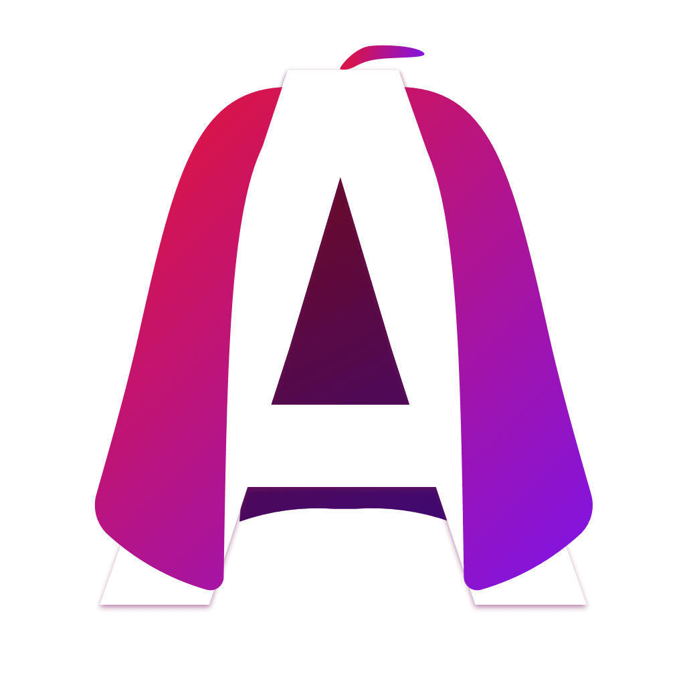

# This is a replacement icon for the Atom editor
> Since I am going to be needing a decent code editor and this one seemed nice but lacked an icon I wanted to see every day...

My personal favorite:
Rainbow Hero, redux

The first:

Rainbow Hero, black typo

Rainbow Hero, white typo

*Sketch files included. Also the project file of Icon Slate, a Mac program I used to create ICNS files from PNGs.
